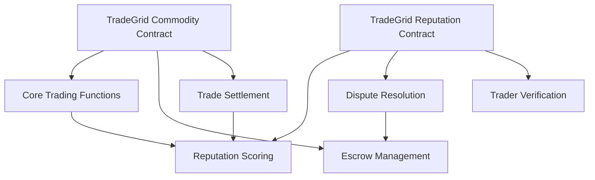

# TradeGrid Commodity Exchange

A decentralized marketplace for peer-to-peer trading of physical commodities on the Stacks blockchain, enabling trustless transactions between producers, distributors, and consumers.

## Overview

TradeGrid creates a transparent and efficient marketplace for commodity trading by:
- Managing peer-to-peer commodity listings and trades
- Providing escrow services for secure transactions
- Implementing a reputation system for trader reliability
- Handling trade disputes through arbitration

### Key Features
- Create and manage commodity listings
- Place buy orders and match trades
- Built-in escrow system for trade settlement
- Comprehensive reputation tracking
- Dispute resolution mechanism
- Support for verified traders and arbitrators

## Architecture

The system consists of two main smart contracts that work together:



### Commodity Contract
Handles the core marketplace functionality including:
- Listing management
- Order matching
- Trade execution
- Escrow services

### Reputation Contract
Manages trader reliability through:
- Reputation scoring
- Trade ratings
- Dispute handling
- Verified trader status

## Contract Documentation

### TradeGrid Commodity Contract

#### Core Functions
- `create-listing` - Create a new commodity listing
- `place-buy-order` - Place a buy order for a commodity
- `place-in-escrow` - Lock funds in escrow for a trade
- `confirm-shipment` - Seller confirms shipment
- `confirm-delivery` - Buyer confirms delivery
- `complete-trade` - Complete trade and release funds

#### Trading Flow
1. Seller creates listing
2. Buyer places order
3. Buyer places funds in escrow
4. Seller confirms shipment
5. Buyer confirms delivery
6. Trade completes and funds release

### TradeGrid Reputation Contract

#### Core Functions
- `submit-rating` - Rate a trading counterparty
- `file-dispute` - Open a dispute for a trade
- `resolve-dispute` - Resolve open disputes
- `adjust-reputation` - Modify trader reputation scores

#### Reputation Management
- Reputation scores range from 0-100
- Ratings impact based on trade volume
- Special status for verified traders
- Dispute resolution affects scores

## Getting Started

### Prerequisites
- Clarinet
- Stacks wallet
- Access to Stacks blockchain

### Installation
1. Clone the repository
2. Install dependencies
```bash
clarinet install
```
3. Run tests
```bash
clarinet test
```

## Function Reference

### Creating a Listing
```clarity
(contract-call? .tradegrid-commodity create-listing
    commodity-type
    quality-grade
    quantity
    unit
    price-per-unit
    location
    delivery-terms)
```

### Placing a Buy Order
```clarity
(contract-call? .tradegrid-commodity place-buy-order
    listing-id
    quantity
    price-per-unit)
```

### Managing Reputation
```clarity
(contract-call? .tradegrid-reputation submit-rating
    trade-id
    ratee
    rating
    comment)
```

## Development

### Testing
Run the test suite:
```bash
clarinet test
```

### Local Development
1. Start Clarinet console:
```bash
clarinet console
```
2. Deploy contracts:
```clarity
(contract-call? .tradegrid-commodity ...)
```

## Security Considerations

### Trading Security
- Always verify trade parameters before execution
- Monitor escrow status throughout trade lifecycle
- Verify counterparty reputation scores
- Use dispute system for any irregularities

### Contract Limitations
- Escrow limited to fungible tokens
- Fixed dispute resolution timeframes
- Admin controls for arbitrator management
- Reputation score adjustments require authorization

### Best Practices
- Verify all counterparties before trading
- Use appropriate escrow amounts
- Document all trade communications
- Report suspicious activity promptly